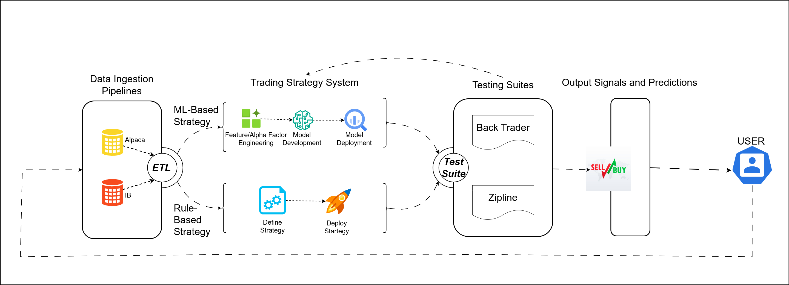

🤖 📈 📉 **ML4Algo: Tools for machine learning-based algorthmic trading**

[](https://pepy.tech/project/pathml)
[](https://pathml.readthedocs.io/en/latest/?badge=latest)
[](https://codecov.io/gh/Dana-Farber-AIOS/pathml)
[](https://github.com/psf/black)
[](https://pypi.org/project/pathml/)

🎯 **ML4Algo objective is to provide tools for research and testing of machine learning-based algorthmic trading platforms**

Financial markets data is growing exponentially in both quantity and information density. The data comes in various forms ranging from curated datasets from vendors to alternative sources (e.g., sentiment analysis). This data stands to benefit derivation of insights for financial trading by leveraging advanced computational analyses approaches such as machine learning and artificial intelligence. In this work, emphasis will be placed on creading systems that are scientifically sound, testable, and documented to guide development of the advanced computational tools for insight derivation and financial markets trading.


🚀 **The fastest way to get started?**

    docker pull ml4algo/ml4algo && docker run -it -p 8888:8888 ml4algo/ml4algo

| Branch | Test status   |
| ------ | ------------- |
| master |  |
| dev    |  |

 


**View [documentation](https://ml4algo.readthedocs.io/en/latest/)**

:construction: the `dev` branch is under active development, with experimental features, bug fixes, and refactors that may happen at any time! 
Stable versions are available as tagged releases on GitHub, or as versioned releases on PyPI

# Installation

There are several ways to install `ML4algo`:

1. `pip install` from PyPI (**recommended for users**)
2. Clone repo to local machine and install from source (recommended for developers/contributors)
3. Use the ML4algo Docker container


We recommend using conda for environment management. 
Download Miniconda [here](https://docs.conda.io/en/latest/miniconda.html)

*Note: these instructions are for Linux. Commands may be different for other platforms.*

## Installation option 1: pip install

Create conda environment:
````
conda create --name ml4algo python=3.8
conda activate ml4algo
````

Optionally install CUDA (instructions [here](#CUDA))

Install `ML4algo` from PyPI:
````
pip install ml4algo
````

## Installation option 2: clone repo and install from source

Clone repo:
````
git clone https://github.com/jbkwizera/ml4algo.git
cd ml4algo
````

Create conda environment:
````
conda env create -f environment.yml
conda activate ml4algo
````

Optionally install CUDA (instructions [here](#CUDA))

Install `ML4algo` from source: 
````
pip install -e .
````

## Installation option 3: Docker

First, download or build the ML4algo Docker container:


- Option A: download ML4algo container from Docker Hub
   ````
   docker pull ml4algo/ml4algo:latest
   ````
  Optionally specify a tag for a particular version, e.g. `docker pull ml4algo/ml4algo:0.0.1`. To view possible tags, 
  please refer to the [ML4algo DockerHub page](https://hub.docker.com/r/ml4algo/ml4algo).
  
- Option B: build docker container from source
   ````
   git clone https://github.com/Dana-Farber-AIOS/ml4algo.git
   cd ml4algo
   docker build -t ml4algo/ml4algo .
   ````

Then connect to the container:
````
docker run -it -p 8888:8888 ml4algo/ml4algo
````

The above command runs the container, which is configured to spin up a jupyter lab session and expose it on port 8888. 
The terminal should display a URL to the jupyter lab session starting with `http://127.0.0.1:8888/lab?token=<.....>`. 
Navigate to that page and you should connect to the jupyter lab session running on the container with the ml4algo 
environment fully configured. If a password is requested, copy the string of characters following the `token=` in the 
url.

Note that the docker container requires extra configurations to use with GPU.  
Note that these instructions assume that there are no other processes using port 8888.

Please refer to the `Docker run` [documentation](https://docs.docker.com/engine/reference/run/) for further instructions
on accessing the container, e.g. for mounting volumes to access files on a local machine from within the container.

## Option 4: Google Colab

To get ML4algo running in a Colab environment:

````
!pip install ml4algo
````

*Thanks to all of our open-source collaborators for helping maintain these installation instructions!*  
*Please open an issue for any bugs or other problems during installation process.*

## CUDA

To use GPU acceleration for model training or other tasks, you must install CUDA. 
This guide should work, but for the most up-to-date instructions, refer to the [official PyTorch installation instructions](https://pytorch.org/get-started/locally/).

Check the version of CUDA:
````
nvidia-smi
````

Install correct version of `cudatoolkit`:
````
# update this command with your CUDA version number
conda install cudatoolkit=11.0
````

After installing PyTorch, optionally verify successful PyTorch installation with CUDA support: 
````
python -c "import torch; print(torch.cuda.is_available())"
````

# Using with Jupyter

Jupyter notebooks are a convenient way to work interactively. To use `ML4algo` in Jupyter notebooks: 

## Register environment as an IPython kernel
````
conda activate ml4algo
conda install ipykernel
python -m ipykernel install --user --name=ml4algo
````
This makes the ml4algo environment available as a kernel in jupyter lab or notebook.


# Contributing

``ML4algo`` is an open source project. Consider contributing to benefit the entire community!

There are many ways to contribute to `ML4algo`, including:

* Submitting bug reports
* Submitting feature requests
* Writing documentation and examples
* Fixing bugs
* Writing code for new features
* Sharing workflows
* Sharing trained model parameters
* Sharing ``ML4algo`` with colleagues, students, etc.

See [contributing](https://github.com/jbkwizera/ml4algo/blob/main/CONTRIBUTING.rst) for more details.

# Users

<table style="border: 0px !important;"><tr><td>This is where in the world our most enthusiastic supporters are located:
   <br/><br/>

   </td><td>   
and this is where they work:
   <br/><br/>

</td>                                                                                                                             
</tr>
</table>

Source: https://ossinsight.io/analyze/Dana-Farber-AIOS/pathml#people

# License

The GNU GPL v2 version of ML4algo is made available via Open Source licensing. 
The user is free to use, modify, and distribute under the terms of the GNU General Public License version 2.

Commercial license options are available also.

# Contact

Questions? Comments? Suggestions? Get in touch!

[jeanbaptistekwi@gmail.com](mailto:jeanbaptistekwi@gmail.com)

 

